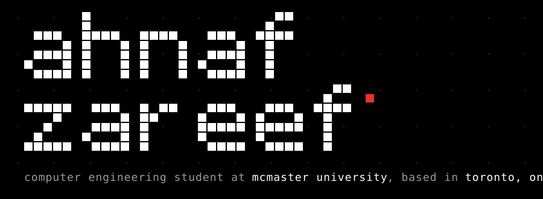

 

`——` **`stack`**

`——` **`selected work`**

| | |
|---|---|
| [**`hardware accelerator ↗`**](https://github.com/ahnafzareef/Hardware-Accelerator) | binarized neural network accelerator on the arty s7 |
| [**`iv curve tracer ↗`**](https://github.com/ahnafzareef/IV-Curve-Tracer) | solar iv curve tracer for the solar car |
| [**`ili9341 driver ↗`**](https://github.com/ahnafzareef/ILI9341Driver) | ili9341 lcd driver with xpt2046 touch on a microblaze softcore |

`——` **`contact`**

[`linkedin ↗`](https://www.linkedin.com/in/ahnafzareef/) &nbsp; [`portfolio ↗`](https://www.ahnafz.dev/) &nbsp; [`email ↗`](mailto:ahnaf.zareef07@gmail.com)
